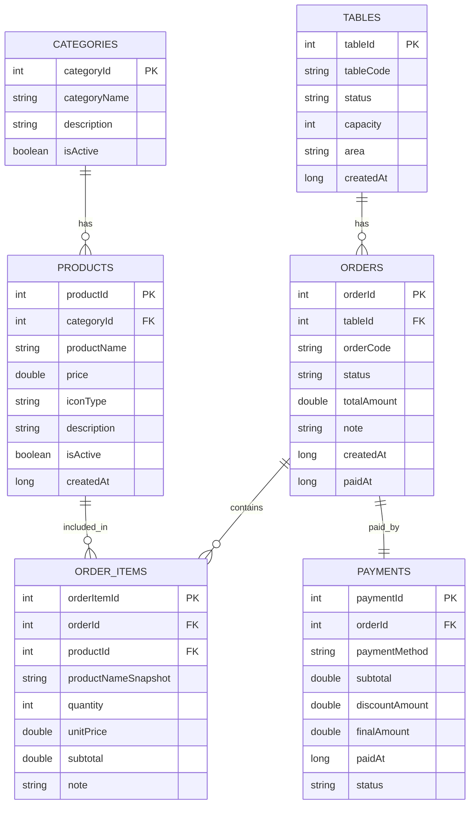
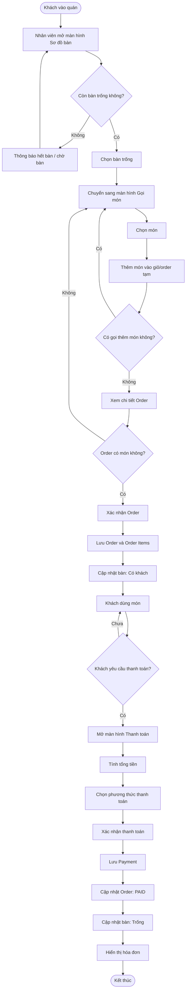
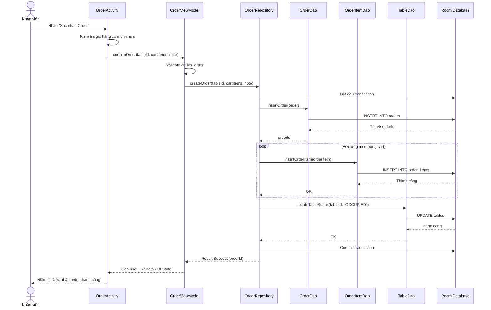

# Prompt Transfer Package for Claude — Android Java Cafe Manager Project

> **Purpose:** Transfer the useful context from the current ChatGPT conversation into a structured Markdown package Claude can read efficiently.  
> **Language:** Vietnamese.  
> **Role for Claude:** Senior Software Engineer + Project Lead for an Android Java school project.

---

## 0. Copy-Paste Prompt for Claude

```text
Bạn là Senior Software Engineer kiêm Project Lead cho đồ án Android Java.

Tôi đang làm đồ án Android Java với đề tài: Ứng dụng quản lý quán cafe. Tôi đã chốt hướng kỹ thuật và MVP như sau:

- Platform: Native Android Mobile App
- Language: Java
- UI: XML Layout, RecyclerView
- Architecture: MVVM + Repository Pattern
- Database: Room Database
- Async/background work: ExecutorService/AppExecutors, không dùng Kotlin Coroutine
- MVP: Sơ đồ bàn → Gọi món → Chi tiết order → Thanh toán → Hóa đơn → Quản lý menu

Tôi muốn bạn tiếp tục hỗ trợ theo hướng:
1. Không mở rộng quá mức ngoài MVP.
2. Ưu tiên code sạch, dễ hiểu, phù hợp sinh viên.
3. Khi viết code Android Java, hãy đi theo thứ tự: Entity → DAO → AppDatabase → Repository → ViewModel → Activity/Adapter/XML.
4. Không để Activity gọi thẳng DAO.
5. Không hard-code status/format tiền lung tung, phải dùng Constants/CurrencyUtils/StatusUtils.
6. Có thể dùng fake data tạm thời cho UI khi database chưa xong.
7. UI sẽ tham khảo prototype đã thiết kế: Table Map, Ordering, Order Review, Payment, Admin Menu, và thêm Invoice screen.

Hãy đọc toàn bộ context bên dưới rồi tiếp tục hỗ trợ tôi lập kế hoạch, chia việc nhóm, viết code, thiết kế database, thiết kế UI, test case hoặc báo cáo.
```

---

# 1. Project Overview

## 1.1 Project Name

```text
Cafe Manager - Ứng dụng Android Java quản lý quán cafe
```

## 1.2 Main Goal

Build a native Android Java app for basic cafe operations.

Core demo flow:

```text
Mở app
→ Xem sơ đồ bàn
→ Chọn bàn trống
→ Gọi món
→ Xem chi tiết order
→ Xác nhận order
→ Bàn chuyển sang "Có khách"
→ Thanh toán
→ Hiển thị hóa đơn
→ Bàn quay về "Trống"
```

## 1.3 MVP Scope

Focus on:

```text
Quản lý bàn
→ Order
→ Thanh toán
→ Menu
```

Do **not** overbuild inventory, employee shifts, loyalty points, real-time sync, kitchen display, or analytics in the MVP.

---

# 2. Final Technical Direction

## 2.1 Correct Technical Stack

```text
Native Android Mobile App
Language: Java
UI: XML Layout
Database: Room Database
Architecture: MVVM + Repository Pattern
List UI: RecyclerView
State/Data: LiveData
Background work: ExecutorService / AppExecutors
```

## 2.2 Important Correction

The prototype text originally mentioned web/Tailwind/Stitch, but the real project is Android Java.

So **do not use Tailwind CSS**. Translate the prototype into Android XML resources:

```text
res/layout/*.xml
res/drawable/*.xml
res/values/colors.xml
res/values/styles.xml
```

## 2.3 Architecture Rule

Correct dependency flow:

```text
Activity / Adapter
↓
ViewModel
↓
Repository
↓
DAO
↓
Room Database / SQLite
```

Do **not** do:

```text
Activity → DAO directly
Adapter → Repository directly
Adapter → Database directly
Repository → Activity
DAO → ViewModel
```

---

# 3. User Personas

## 3.1 Waitstaff / Nhân viên phục vụ

Needs to:

```text
Xem trạng thái bàn
Chọn bàn
Gọi món
Thêm/xóa/tăng/giảm món trong order
Xác nhận order
```

Main screens:

```text
TableActivity
MenuActivity
OrderActivity
```

## 3.2 Cashier / Thu ngân

Needs to:

```text
Xem order của bàn có khách
Chọn phương thức thanh toán
Xác nhận thanh toán
Xem hóa đơn
```

Main screens:

```text
OrderActivity
PaymentActivity
InvoiceActivity
```

## 3.3 Manager / Quản lý

Needs to:

```text
Xem menu
Thêm món
Sửa tên/giá món
Ẩn/hiện món
Quản lý danh mục cơ bản
```

Main screen:

```text
AdminMenuActivity
```

## 3.4 Authentication Note

MVP does **not** need real login/role-based access control. In the report, mention that login/role control is a future extension.

---

# 4. Final MVP Screens

Final decision: **6 MVP screens**.

| No. | Screen | Java Class | Main Purpose |
|---|---|---|---|
| 1 | Sơ đồ bàn | `TableActivity` | View table status |
| 2 | Gọi món | `MenuActivity` | Select products for a table |
| 3 | Chi tiết order | `OrderActivity` | Review cart/order and confirm |
| 4 | Thanh toán | `PaymentActivity` | Select payment method and pay |
| 5 | Hóa đơn | `InvoiceActivity` | Show invoice after payment |
| 6 | Quản lý menu | `AdminMenuActivity` | Add/edit/hide/show products |

---

# 5. Prototype UI Reference

The user designed 5 prototype screens and wants to apply them to the original Android Java idea.

## 5.1 Screen 1 — Table Map / Sơ đồ bàn

Visual details:

```text
Title: "Sơ đồ bàn"
Search icon
Legend:
- Green dot: Trống
- Peach/orange dot: Có khách

Grid of table cards:
B01, B02, B03...
Green cards = Trống
Peach/orange cards = Có khách

Statistic card:
"Buổi sáng năng suất nhé!"
"Đang có 4/10 bàn hoạt động."

Floating + button
Bottom nav:
Bàn | Order | Menu
```

Recommended behavior:

```text
Click table EMPTY → MenuActivity
Click table OCCUPIED → OrderActivity or PaymentActivity
```

Important adjustment:

```text
Do not allow manual table status toggling in MVP.
Table status should change by business events:
- Confirm order → table becomes OCCUPIED
- Payment success → table becomes EMPTY
```

## 5.2 Screen 2 — Ordering / Gọi món - Bàn B01

Visual details:

```text
Dark top app bar:
Back button
Title: "Gọi món - Bàn B01"
Search icon

Category chips:
Tất cả | Cà phê | Trà | Sinh tố | Bánh

2-column product grid
Product card:
Icon/image
Product name
Price
+ button

Bottom cart bar:
"3 món đã chọn"
"118.000đ"
Button: "XEM ORDER"
```

Recommended adjustment:

```text
Remove product rating from MVP.
Rating is not needed for internal cafe management.
Product card should only show: icon/image, name, price, add button.
```

## 5.3 Screen 3 — Order Review / Chi tiết Order - Bàn B01

Prototype currently shows empty state.

Visual details:

```text
Top bar:
Back arrow
Title: "Chi tiết Order - Bàn B01"
Menu/more icon

Empty state:
Cute cup illustration
Text: "Chưa có món nào. Quay lại để gọi món."

Bottom panel:
"Tổng tiền"
"0đ"
Button: "Xác nhận Order"
```

Required states:

```text
State 1: Cart empty
- show empty state
- total = 0đ
- confirm button disabled

State 2: Cart has items
- show RecyclerView of order items
- allow increase/decrease/remove item
- update total in real time
- confirm button enabled
```

## 5.4 Screen 4 — Payment / Thanh toán - Bàn B01

Visual details:

```text
Dark chocolate app bar:
Back button
Title: "Thanh toán - Bàn B01"

Payment summary:
Tạm tính
Giảm giá
Tổng cộng

Promotion code input:
"Nhập mã giảm giá."
Button: "Áp dụng"

Payment methods:
Tiền mặt
Chuyển khoản
QR (VNPay)
Momo

Bottom button:
"Xác nhận thanh toán"
```

Recommended adjustment:

```text
Keep payment methods:
- CASH / Tiền mặt
- BANKING / Chuyển khoản
- MOMO

QR/VNPay can be displayed as simulated option, but no real integration in MVP.
No need for VAT unless required.
Use subtotal, discountAmount, finalAmount.
```

## 5.5 Screen 5 — Admin Menu / Quản lý Menu

Visual details:

```text
Title: "Quản lý Menu"
+ button
Category chips:
Tất cả | Cà phê | Trà | ...

List item:
Product icon
Product name
Price
Status badge: Hiện / Ẩn
Edit button

Bottom nav:
Bàn | Order | Menu
```

Required logic:

```text
Hiện = isActive = true
Ẩn = isActive = false
```

Important rule:

```text
Do not hard delete products.
Use soft delete / visibility toggle:
isActive = false
```

Reason:

```text
Products may already appear in old order/invoice history.
Hard delete can break historical data.
```

## 5.6 Missing Screen — Invoice / Hóa đơn

The prototype does not yet include a separate invoice screen, but the project should add it.

`InvoiceActivity` should show:

```text
Mã hóa đơn / order code
Bàn
Danh sách món
Số lượng
Đơn giá
Thành tiền
Tạm tính
Giảm giá
Tổng cộng
Phương thức thanh toán
Thời gian thanh toán
Button: Quay về Sơ đồ bàn
```

Reason for separate screen:

```text
PaymentActivity = choose and confirm payment
InvoiceActivity = display final result after successful payment
```

---

# 6. Final Navigation Flow

## 6.1 Ordering Flow

```text
TableActivity
→ click B01 EMPTY
→ MenuActivity
→ add products
→ OrderActivity
→ confirm order
→ TableActivity
→ B01 becomes OCCUPIED
```

## 6.2 Payment Flow

```text
TableActivity
→ click B01 OCCUPIED
→ OrderActivity
→ PaymentActivity
→ confirm payment
→ InvoiceActivity
→ return TableActivity
→ B01 becomes EMPTY
```

## 6.3 Admin Menu Flow

```text
BottomNav Menu
→ AdminMenuActivity
→ add/edit/hide/show product
```

---

# 7. ERD MVP

## 7.1 Final MVP Tables

The ERD should only include 6 core tables:

```text
1. tables
2. categories
3. products
4. orders
5. order_items
6. payments
```

Do **not** include these in MVP:

```text
employees
roles
shifts
inventory
ingredients
recipes
loyalty points
customers
complex promotions
toppings
size variants
```

These can be future extensions.

## 7.2 Relationships

```text
tables 1 - n orders
categories 1 - n products
orders 1 - n order_items
products 1 - n order_items
orders 1 - 1 payments
```

## 7.3 Mermaid ERD



## 7.4 Important Data Design Decisions

### Store `unitPrice` in `order_items`

Reason:

```text
If product price changes later, old invoices should keep the old price.
```

### Store `productNameSnapshot` in `order_items`

Reason:

```text
If product name changes later, old invoices should show the original sold name.
```

### Use `isActive` for product visibility

Reason:

```text
Avoid breaking invoice/order history.
```

---

# 8. Flowchart

The flowchart explains the business flow, not the code.



---

# 9. Sequence Diagram

Use this for the specific action: staff taps **"Xác nhận Order"**.



Important technical note:

```text
In Java, do not use Dispatchers.IO. Use ExecutorService/AppExecutors.
```

---

# 10. Event & Action Table

## 10.1 Confirm Order

| Layer | Event | Action |
|---|---|---|
| `OrderActivity` | User taps Confirm Order | Get cart items, call ViewModel |
| `OrderViewModel` | Receives `confirmOrder()` | Validate data, set loading state, call Repository |
| `OrderRepository` | Receives valid order request | Insert order, insert items, update table in transaction |
| `OrderDao` | Repository calls `insertOrder()` | Insert into `orders` |
| `OrderItemDao` | Repository calls `insertOrderItems()` | Insert into `order_items` |
| `TableDao` | Repository calls `updateTableStatus()` | Update table to `OCCUPIED` |
| `Room Database` | Receives insert/update commands | Persist data |
| `OrderActivity` | Observes result | Show success/error, navigate |

## 10.2 Confirm Payment

| Layer | Event | Action |
|---|---|---|
| `PaymentActivity` | User taps Confirm Payment | Validate selected payment method |
| `PaymentViewModel` | Receives `payOrder()` | Validate amount/payment method |
| `PaymentRepository` | Receives valid payment request | Insert payment, update order, update table |
| `PaymentDao` | Insert payment | Save payment record |
| `OrderDao` | Update order | Set order status to `PAID` |
| `TableDao` | Update table | Set table status to `EMPTY` |
| `InvoiceActivity` | Receives paid order | Display invoice |

---

# 11. Android Project Structure

```text
com.example.cafemanager
│
├── data
│   ├── local
│   │   ├── AppDatabase.java
│   │   ├── dao
│   │   │   ├── TableDao.java
│   │   │   ├── CategoryDao.java
│   │   │   ├── ProductDao.java
│   │   │   ├── OrderDao.java
│   │   │   ├── OrderItemDao.java
│   │   │   └── PaymentDao.java
│   │   │
│   │   └── entity
│   │       ├── TableEntity.java
│   │       ├── CategoryEntity.java
│   │       ├── ProductEntity.java
│   │       ├── OrderEntity.java
│   │       ├── OrderItemEntity.java
│   │       └── PaymentEntity.java
│   │
│   └── repository
│       ├── TableRepository.java
│       ├── MenuRepository.java
│       ├── OrderRepository.java
│       └── PaymentRepository.java
│
├── model
│   ├── CartItem.java
│   ├── OrderWithItems.java
│   ├── PaymentMethodItem.java
│   └── ProductWithCategory.java
│
├── ui
│   ├── common
│   │   ├── BaseActivity.java
│   │   ├── OnItemClickListener.java
│   │   └── QuantityChangeListener.java
│   │
│   ├── table
│   │   ├── TableActivity.java
│   │   └── TableAdapter.java
│   │
│   ├── menu
│   │   ├── MenuActivity.java
│   │   ├── ProductAdapter.java
│   │   └── CategoryAdapter.java
│   │
│   ├── order
│   │   ├── OrderActivity.java
│   │   └── OrderItemAdapter.java
│   │
│   ├── payment
│   │   ├── PaymentActivity.java
│   │   ├── PaymentMethodAdapter.java
│   │   └── InvoiceActivity.java
│   │
│   └── admin
│       ├── AdminMenuActivity.java
│       └── AdminProductAdapter.java
│
├── util
│   ├── AppExecutors.java
│   ├── Constants.java
│   ├── CurrencyUtils.java
│   ├── DateTimeUtils.java
│   ├── StatusUtils.java
│   └── OrderCalculator.java
│
├── viewmodel
│   ├── TableViewModel.java
│   ├── MenuViewModel.java
│   ├── OrderViewModel.java
│   ├── PaymentViewModel.java
│   └── AdminMenuViewModel.java
│
└── MainActivity.java
```

---

# 12. Layout and Drawable Structure

## 12.1 Layout Files

```text
activity_table.xml
activity_menu.xml
activity_order.xml
activity_payment.xml
activity_invoice.xml
activity_admin_menu.xml

item_table_card.xml
item_category_chip.xml
item_product_card.xml
item_order_item.xml
item_payment_method.xml
item_invoice_item.xml
item_admin_product.xml

component_top_bar_light.xml
component_top_bar_dark.xml
component_bottom_nav.xml
component_bottom_cart_bar.xml
component_bottom_total_panel.xml
component_empty_state.xml
component_payment_summary.xml
component_status_legend.xml

dialog_confirm.xml
dialog_product_form.xml
dialog_note.xml
```

## 12.2 Drawable Files

```text
bg_table_empty.xml
bg_table_occupied.xml
bg_product_card.xml
bg_category_selected.xml
bg_category_unselected.xml
bg_bottom_cart_bar.xml
bg_bottom_nav.xml
bg_button_primary.xml
bg_badge_empty.xml
bg_badge_occupied.xml
bg_badge_paid.xml
bg_badge_inactive.xml
bg_card.xml
bg_input.xml
```

---

# 13. Reusable Components

## 13.1 UI Components

| Component | File | Used In |
|---|---|---|
| Top bar light | `component_top_bar_light.xml` | Table, Order, Admin Menu |
| Top bar dark | `component_top_bar_dark.xml` | Menu, Payment |
| Bottom navigation | `component_bottom_nav.xml` | Table, Admin Menu, maybe Order list |
| Category chips | `item_category_chip.xml` | Menu, Admin Menu |
| Bottom cart bar | `component_bottom_cart_bar.xml` | Menu |
| Bottom total panel | `component_bottom_total_panel.xml` | Order, Payment |
| Empty state | `component_empty_state.xml` | Empty order/menu |
| Confirm dialog | `dialog_confirm.xml` | Confirm order/payment/hide product |
| Product form dialog | `dialog_product_form.xml` | Add/edit product |
| Status badge style | drawables/styles | Table, Order, Product |

## 13.2 Java Utilities

### `Constants.java`

```java
public class Constants {
    public static final String TABLE_EMPTY = "EMPTY";
    public static final String TABLE_OCCUPIED = "OCCUPIED";

    public static final String ORDER_OPEN = "OPEN";
    public static final String ORDER_CONFIRMED = "CONFIRMED";
    public static final String ORDER_PAID = "PAID";
    public static final String ORDER_CANCELLED = "CANCELLED";

    public static final String PAYMENT_CASH = "CASH";
    public static final String PAYMENT_BANKING = "BANKING";
    public static final String PAYMENT_MOMO = "MOMO";

    public static final String PAYMENT_SUCCESS = "SUCCESS";
    public static final String PAYMENT_FAILED = "FAILED";
}
```

### `CurrencyUtils.java`

Purpose:

```text
Format 35000 → 35.000đ
```

Rule:

```text
Do not format money manually in each Activity/Adapter.
```

### `StatusUtils.java`

Purpose:

```text
EMPTY → Trống
OCCUPIED → Có khách
PAID → Đã thanh toán
```

### `OrderCalculator.java`

Purpose:

```text
subtotal = unitPrice * quantity
total = sum(subtotal)
finalAmount = total - discount
```

### `AppExecutors.java`

Purpose:

```text
Run database work on background thread in Java.
```

---

# 14. Team Plan

Assume group has 4 members.

| Member | Role | Main Responsibility |
|---|---|---|
| Member 1 | Project Setup + Database Lead | Room, Entity, DAO, Repository, seed data |
| Member 2 | Table + Menu UI Lead | TableActivity, MenuActivity, adapters, UI components |
| Member 3 | Order + Payment Lead | OrderActivity, PaymentActivity, InvoiceActivity |
| Member 4 | Report + QA Lead | diagrams, report, screenshots, tests, slides |

Important team rule:

```text
Do not split by technical layer like:
A does Activity, B does ViewModel, C does Repository, D does DAO.

Instead:
Member 1 builds database foundation.
Member 2 builds Table/Menu UI.
Member 3 builds Order/Payment/Invoice.
Member 4 handles report/QA.
```

---

# 15. Member 1 Plan — Project Setup + Database Lead

## 15.1 Responsibility

Member 1 builds the technical foundation:

```text
Create Android project
Setup dependencies
Create package structure
Create Room entities
Create DAO interfaces
Create AppDatabase singleton
Create AppExecutors
Create repositories
Seed sample data
```

## 15.2 Branch

```text
feature/project-setup
feature/database-room
```

## 15.3 Day Plan

### Day 1

```text
Create project
Setup Gradle
Create package structure
Create Constants
Create Entity classes
```

### Day 2

```text
Create DAO interfaces
Create AppDatabase singleton
Create AppExecutors
Compile database layer
```

### Day 3

```text
Create repositories
Create seed data
Test database
Hand off functions to Member 2 and Member 3
```

## 15.4 Entity Classes

```text
TableEntity.java
CategoryEntity.java
ProductEntity.java
OrderEntity.java
OrderItemEntity.java
PaymentEntity.java
```

## 15.5 DAO Classes

```text
TableDao.java
CategoryDao.java
ProductDao.java
OrderDao.java
OrderItemDao.java
PaymentDao.java
```

## 15.6 Repository Functions to Provide

For Member 2:

```text
getAllTables()
getActiveCategories()
getActiveProducts()
getProductsByCategory(categoryId)
updateProductActiveStatus(productId, isActive)
```

For Member 3:

```text
confirmOrder(tableId, cartItems, note)
getActiveOrderByTable(tableId)
getItemsByOrderId(orderId)
payOrder(orderId, tableId, paymentMethod)
```

## 15.7 Seed Data

Tables:

```text
B01 - EMPTY - 2 seats
B02 - EMPTY - 4 seats
B03 - EMPTY - 4 seats
B04 - EMPTY - 6 seats
B05 - EMPTY - 2 seats
B06 - EMPTY - 4 seats
B07 - EMPTY
B08 - EMPTY
B09 - EMPTY
B10 - EMPTY
```

Categories:

```text
Cà phê
Trà
Sinh tố
Bánh
```

Products:

```text
Cà phê sữa đá - 35000
Bạc xỉu - 38000
Trà sữa trân châu - 45000
Sinh tố bơ - 50000
Bánh Tiramisu - 55000
Trà đào cam sả - 45000
```

## 15.8 Member 1 Acceptance Criteria

```text
[ ] Project runs
[ ] Gradle sync works
[ ] Package structure exists
[ ] 6 entities exist
[ ] 6 DAOs exist
[ ] AppDatabase singleton works
[ ] AppExecutors exists
[ ] Repositories exist
[ ] Seed data exists
[ ] No allowMainThreadQueries() in final version
[ ] Activity does not call DAO directly
[ ] Code pushed to GitHub
```

---

# 16. Member 2 Plan — Table + Menu UI Lead

## 16.1 Responsibility

Member 2 builds:

```text
TableActivity
MenuActivity
TableAdapter
ProductAdapter
CategoryAdapter
Related XML layouts
Reusable UI components for table/menu
```

## 16.2 Main Screens

### TableActivity

Needs:

```text
Title: Sơ đồ bàn
Search icon
Legend: Trống / Có khách
Grid of tables
Status colors
Statistic card
Bottom navigation
```

Behavior:

```text
Click EMPTY table → MenuActivity
Click OCCUPIED table → OrderActivity or PaymentActivity later
```

### MenuActivity

Needs:

```text
Top bar: Gọi món - Bàn B01
Category chips
2-column product grid
Product cards
+ button
Bottom cart bar when cart has items
```

Behavior:

```text
Click + → add product to cart
Update total quantity
Update total amount
Show bottom cart bar
Click XEM ORDER → OrderActivity
```

## 16.3 Files

Java:

```text
ui/table/TableActivity.java
ui/table/TableAdapter.java

ui/menu/MenuActivity.java
ui/menu/ProductAdapter.java
ui/menu/CategoryAdapter.java

ui/common/OnItemClickListener.java
```

XML:

```text
activity_table.xml
item_table_card.xml
activity_menu.xml
item_product_card.xml
item_category_chip.xml
component_bottom_nav.xml
component_bottom_cart_bar.xml
component_status_legend.xml
```

Drawables:

```text
bg_table_empty.xml
bg_table_occupied.xml
bg_product_card.xml
bg_category_selected.xml
bg_category_unselected.xml
bg_bottom_cart_bar.xml
bg_bottom_nav.xml
bg_button_primary.xml
```

## 16.4 Fake Data Allowed

Member 2 can work before database is done using fake data.

Fake tables:

```text
B01 - EMPTY
B02 - OCCUPIED
B03 - EMPTY
B04 - OCCUPIED
B05 - EMPTY
B06 - OCCUPIED
B07 - EMPTY
B08 - EMPTY
B09 - OCCUPIED
B10 - EMPTY
```

Fake categories:

```text
Tất cả
Cà phê
Trà
Sinh tố
Bánh
```

Fake products:

```text
Cà phê sữa đá - 35000
Bạc xỉu - 38000
Trà sữa trân châu - 45000
Sinh tố bơ - 50000
Bánh Tiramisu - 55000
Trà đào cam sả - 45000
```

## 16.5 Day Plan

### Day 1 — TableActivity

```text
Create activity_table.xml
Create item_table_card.xml
Create TableActivity.java
Create TableAdapter.java
Display fake tables with RecyclerView GridLayoutManager
Color cards based on EMPTY/OCCUPIED
```

Commit:

```text
feat: create table map screen
```

### Day 2 — MenuActivity

```text
Create activity_menu.xml
Create item_product_card.xml
Create item_category_chip.xml
Create MenuActivity.java
Create ProductAdapter.java
Create CategoryAdapter.java
Display fake product data in 2-column grid
Filter by category
```

Commit:

```text
feat: create menu ordering screen
```

### Day 3 — Cart Bar and Interaction

```text
Add + click handling
Track cart items
Calculate total quantity
Calculate total amount
Show component_bottom_cart_bar when cart has items
Click XEM ORDER → OrderActivity
```

Commit:

```text
feat: add cart summary bar to menu screen
```

### Day 4 — Connect Real Data

```text
Replace fake tables with getAllTables()
Replace fake categories with getActiveCategories()
Replace fake products with getActiveProducts()
Connect ViewModel if ready
Handle empty state
```

Commit:

```text
feat: connect table and menu screens to room data
```

### Day 5 — Polish UI and Test

```text
Adjust padding/margins
Check small screens
Check status colors
Check currency format
Check click spam on +
Check category selected/unselected style
```

Commit:

```text
ui: polish table and menu screens
```

## 16.6 Member 2 Acceptance Criteria

```text
[ ] TableActivity shows table grid
[ ] EMPTY and OCCUPIED have different colors
[ ] Click EMPTY table opens MenuActivity
[ ] MenuActivity receives tableId/tableCode
[ ] MenuActivity shows category chips
[ ] MenuActivity shows product grid
[ ] Category filter works
[ ] + button adds item to cart
[ ] Bottom cart bar appears when cart has items
[ ] Total quantity and total amount update correctly
[ ] XEM ORDER opens OrderActivity
[ ] Uses CurrencyUtils for money
[ ] Uses Constants for status
[ ] Adapter does not call database
```

---

# 17. Member 3 Plan — Placeholder

Member 3 should own:

```text
OrderActivity
PaymentActivity
InvoiceActivity
OrderItemAdapter
PaymentMethodAdapter
component_empty_state.xml
component_bottom_total_panel.xml
component_payment_summary.xml
item_order_item.xml
item_payment_method.xml
item_invoice_item.xml
dialog_confirm.xml
```

Expected flow:

```text
Receive tableId/tableCode/cartItems from MenuActivity
Display order review
Handle quantity increase/decrease/remove
Confirm order
Open PaymentActivity for occupied table
Select payment method
Confirm payment
Open InvoiceActivity
```

This should be the next planning task if needed.

---

# 18. Member 4 Plan — Placeholder

Member 4 should own:

```text
Report
ERD image
Flowchart image
Sequence diagram image
Use case diagram
UI screenshots
Test cases
Slide/demo script
QA checklist
```

Report should explain:

```text
Why MVP has 6 screens
Why Room Database
Why MVVM + Repository
Why soft delete product
Why transaction for confirm order/payment
How UI prototype maps to implementation
```

---

# 19. Project Timeline

## Week 1 — Design + Database Foundation

| Day | Task |
|---|---|
| Day 1 | Scope, roles, GitHub, project sheet |
| Day 2 | ERD, Flowchart, Sequence Diagram, Wireframe |
| Day 3 | Android project setup |
| Day 4 | Entity + DAO |
| Day 5 | AppDatabase + seed data |
| Day 6 | Test database |
| Day 7 | Buffer |

## Week 2 — Main App Flow

| Day | Task |
|---|---|
| Day 8 | Table screen |
| Day 9 | Menu screen |
| Day 10 | Cart interaction |
| Day 11 | Order screen |
| Day 12 | Confirm order |
| Day 13 | Payment screen |
| Day 14 | Invoice screen |

## Week 3 — Admin + Report

| Day | Task |
|---|---|
| Day 15 | Admin menu CRUD |
| Day 16 | UI polish |
| Day 17 | Test cases |
| Day 18 | Bug fixes |
| Day 19 | Report |
| Day 20 | Slides |
| Day 21 | Demo rehearsal |

---

# 20. Git Workflow

## Branches

```text
main
develop
feature/project-setup
feature/database-room
feature/table-screen
feature/menu-screen
feature/order-flow
feature/payment-flow
feature/admin-menu
feature/report-docs
```

## Rules

```text
Do not commit directly to main
Each member works on a feature branch
Merge into develop after testing
Push code daily
Before merge, app must compile
```

## Commit Format

```text
feat: add table entity and dao
feat: create menu screen
fix: update order total calculation
docs: add ERD diagram
ui: improve payment screen layout
chore: add room dependencies
```

---

# 21. Google Sheet / Project Hub

A simple project management spreadsheet was created earlier with these sheets:

```text
Dashboard
Links
Tasks
Scope
Report
Decisions
```

Recommended use:

```text
Dashboard = progress snapshot
Links = GitHub/Figma/report/slides/diagrams
Tasks = task board
Scope = MVP vs future features
Report = report checklist
Decisions = technical decision log
```

Important decision log entries:

```text
Use Android Java + XML, not web/Tailwind.
Use Room Database instead of raw SQLite.
Use MVVM + Repository.
MVP uses 6 screens.
MVP uses 6 database tables.
Use soft delete for menu items.
Use transaction when confirming order/payment.
Use AppExecutors for background database work in Java.
```

---

# 22. Important Rules to Preserve

## 22.1 Do Not Over-Scope

Do not build these in MVP:

```text
Real-time sync
Kitchen Display System
Inventory
Employee shifts
Role-based login
Loyalty points
Advanced promotions
VNPay real integration
Sales dashboard
```

Put them in Future Roadmap.

## 22.2 Do Not Over-Engineer

Avoid:

```text
Generic BaseRecyclerViewAdapter
Complex custom views
Dependency Injection framework
Multi-module architecture
Full domain/usecase layer
Complex navigation framework
```

MVP should be simple and working.

## 22.3 Preserve Prototype Style

The UI style should preserve:

```text
Soft pastel colors
Rounded cards
Clear table status colors
Bottom nav with pill shapes
2-column product grid
Bottom cart/total bar
Cute empty state
Dark chocolate app bars on ordering/payment
```

## 22.4 Standard Status Values

Use constants:

```text
TABLE_EMPTY = EMPTY
TABLE_OCCUPIED = OCCUPIED
ORDER_OPEN = OPEN
ORDER_CONFIRMED = CONFIRMED
ORDER_PAID = PAID
ORDER_CANCELLED = CANCELLED
PAYMENT_CASH = CASH
PAYMENT_BANKING = BANKING
PAYMENT_MOMO = MOMO
PAYMENT_SUCCESS = SUCCESS
PAYMENT_FAILED = FAILED
```

Do not mix strings like:

```text
"empty"
"Trống"
"table_empty"
"EMPTY "
```

## 22.5 Standard Money Format

All money formatting should use:

```text
CurrencyUtils.formatVnd()
```

Expected output:

```text
35000 → 35.000đ
```

## 22.6 Transaction Rules

Confirm order should be atomic:

```text
insert order
insert order items
update table status to OCCUPIED
```

Confirm payment should be atomic:

```text
insert payment
update order status to PAID
update table status to EMPTY
```

---

# 23. Future Roadmap

For report/future work:

```text
Real-time sync across multiple devices
Kitchen Display System for baristas/chefs
Sales reporting dashboard
Inventory and ingredient tracking
Employee login and role-based access control
Customer loyalty points
Promotion engine
Printer integration
VNPay/Momo real payment integration
```

---

# 24. Recommended Next Tasks for Claude

When continuing this project, Claude should help with one of these next tasks:

```text
1. Write detailed plan for Member 3 - Order + Payment + Invoice.
2. Write detailed plan for Member 4 - Report + QA.
3. Generate Android Java code for the 6 Room Entity classes.
4. Generate DAO interfaces for the 6 tables.
5. Generate AppDatabase.java and AppExecutors.java.
6. Generate XML layouts for TableActivity/MenuActivity based on the prototype.
7. Generate adapters: TableAdapter, ProductAdapter, CategoryAdapter.
8. Generate test case table for the report.
9. Generate report structure for the Android Java Cafe Manager project.
```

---

# 25. Final One-Line Summary

```text
This project is a Native Android Java Cafe Manager app using XML + Room + MVVM, with a 6-screen MVP based on the user's prototype: Table Map, Ordering, Order Review, Payment, Invoice, and Admin Menu.
```
